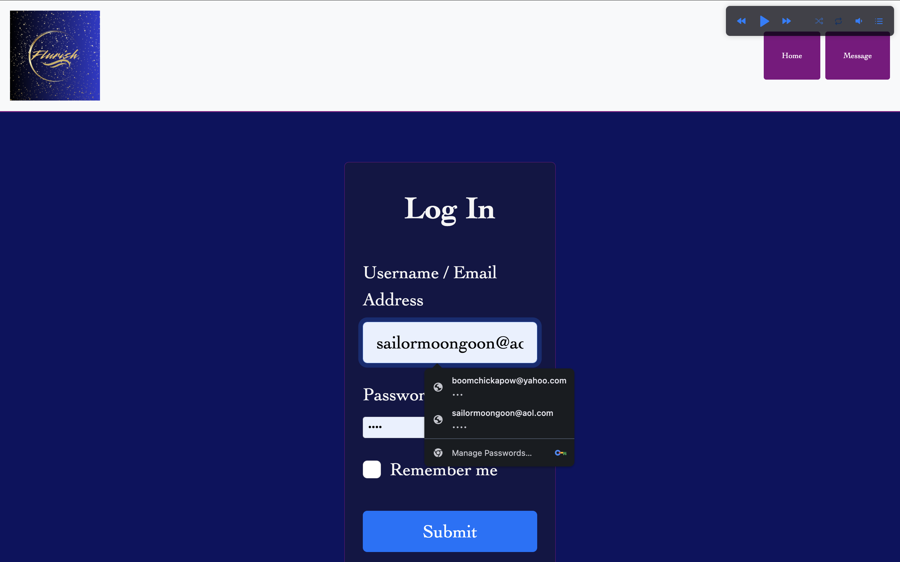

# "Flurish"
Flurish is a social media blogging and posting app designed for those who seek meaningful connections in the digital space. At Flurish, we believe that online interactions should go beyond surface-level exchanges. Our platform encourages users to connect with intention, fostering deeper relationships and a vibrant, supportive community.
Flurish prioritizes safety and inclusivity, creating a secure environment where users can share their stories, passions, and insights without fear. Here, every post, comment, and conversation is a step towards building a more authentic and compassionate online world. Let's Flurish together. 🌱

## Homepage
- **Logo:** Showcasing the app name: Flurish- highlighting the business identntiy, the name. 
- **Navigation:** Showing the buttons that direct you to: Sign-Up!, Login, Message, and Profile
- **Infomercial:** Promoting the introduction of the app.
- **Bio 1:** Describing the brand message, explaining what the app is. 
- **Photos:** Images of the "community" of Flurish. 
- **Bio 2:** Another quick description of the brand mission/purpose.
- **Music Widgit:** fucntional and responsive music playlist. Can play/pause, shuffle list, and hides menu list for viewer purposes. 

## Sign-Up!
- **Sign-Up Form:** Functional / repsonsive form. Username/ Email to begin signing up for Flurish, Full Name, and a protected Password. Sign- Up button to complete. 

## Login
- **Login Form:** Functional / repsonsive form. Username/ Email to login to exisiting account for Flurish, "Remember Me", "Forgot Password?", working Submit button to complete. 

## Message
- **Messages/Posts:** Message board where posts from users are displayed. The user , time, and text as well as likes are displayed. A "Flutter" is a like. "Flutters" are the amount of likes. Functional "Sort-By" displays newest posts, older posts, and the most "Flutters" to show engaagment. 

## Send New Message
- **Send New Message/ Text:** Sending a text to the message board on it's on page once logged in. 

## Profile/ Edit User Profile
- **Edit User Profile:** Updating authorized users profile bios. Refill form with full name, new bio, and your password. 

